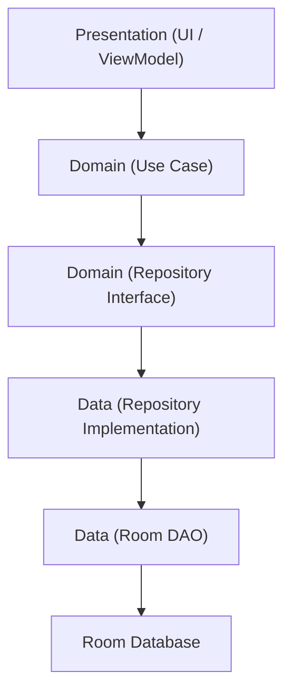

# Arquitectura del Proyecto

## Flujo de Datos

```mermaid
graph TD
    UI["Presentation (UI / ViewModel)"] --> UseCase["Domain (Use Case)"]
    UseCase --> Repository["Domain (Repository Interface)"]
    Repository --> Implementation["Data (Repository Implementation)"]
    Implementation --> DAO["Data (Room DAO)"]
    DAO --> DB["Room Database"]
```
