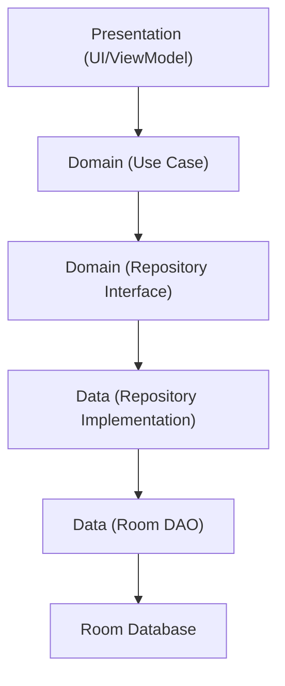

# Arquitectura del Sistema Don Elio

Este documento detalla exhaustivamente la estructura de directorios, el flujo de datos y la arquitectura subyacente del proyecto "Don Elio", una aplicación Android moderna construida con **Kotlin, Jetpack Compose y Clean Architecture**.

---

## 1. Patrón General: Clean Architecture

El proyecto utiliza un enfoque estricto de **Clean Architecture** (Arquitectura Limpia). El objetivo principal de este patrón es la **separación de responsabilidades** en capas independientes, lo que permite que la interfaz de usuario, las reglas de negocio y la base de datos no se acoplen rígidamente. 

La estructura principal se divide en 4 grandes bloques que residen en `app/src/main/java/com/itec/donelio/`:
1. `data` (Capa de Datos)
2. `domain` (Capa de Dominio / Negocio)
3. `presentation` (Capa de Presentación / UI)
4. `di` (Inyección de Dependencias)

---

## 2. Estructura de Directorios Detallada

A continuación, desglosamos cada carpeta y su responsabilidad exacta dentro del flujo:

### 📂 `data` (Capa de Datos)
Esta capa es la única que sabe cómo y de dónde obtener o guardar la información (en este caso, de la base de datos local Room). No contiene reglas de negocio, solo operaciones de lectura/escritura.
* **`local/`**: Contiene todo lo relacionado con Room (la base de datos offline).
  * **`dao/`** (Data Access Objects): Interfaces con anotaciones SQL (ej. `@Query`, `@Insert`) que definen cómo leer y escribir en las tablas (ej. `CampaniaDao.kt`, `TareaDao.kt`).
  * **`entity/`**: Clases de datos que representan exactamente cómo se guardan las tablas en SQLite. Tienen anotaciones como `@Entity` y `@PrimaryKey` (ej. `CampaniaEntity.kt`).
* **`mapper/`**: Contiene funciones de extensión (ej. `toDomain()`, `toEntity()`). Su trabajo es traducir los objetos de base de datos (`Entity`) a objetos puros de negocio (`Model`) y viceversa. Esto aísla al resto de la app de los detalles de Room.
* **`repository/`**: Contiene las **implementaciones** de los repositorios (ej. `CampaniaRepositoryImpl.kt`). Implementan las interfaces definidas en la capa `domain` y deciden qué DAO usar para cumplir con los requerimientos.

### 📂 `domain` (Capa de Dominio)
Es el "corazón" de la aplicación. No sabe nada de bases de datos ni de interfaces gráficas. Es puro Kotlin. Si mañana cambiamos Room por Firebase, o Compose por XML, esta capa no debería sufrir ninguna modificación.
* **`model/`**: Clases de datos puras (POJOs) que representan los conceptos reales del negocio (ej. `Campania.kt`, `Tarea.kt`, `Insumo.kt`). No tienen anotaciones de base de datos.
* **`repository/`**: Contiene **interfaces** puras (ej. `CampaniaRepository.kt`). Definen los "contratos" (qué funciones deben existir para guardar o traer datos), pero no cómo se hacen. 
* **`use_case/`**: Contiene los "Casos de Uso". Cada archivo representa **una única acción específica** que un usuario puede hacer (ej. `CrearCampaniaUseCase.kt`, `ObtenerTareasPendientesUseCase.kt`). Orquestan la lógica de negocio y llaman a los repositorios.

### 📂 `presentation` (Capa de Presentación)
Contiene todo lo que el usuario ve en pantalla y cómo interactúa con ello.
* **`ui/`**: Toda la interfaz gráfica construida en Jetpack Compose.
  * **`components/`**: Elementos visuales reutilizables a lo largo de la app (botones personalizados, tarjetas, barras superiores).
  * **`screen/`**: Las pantallas completas de la aplicación, agrupadas por "features" o módulos funcionales (ej. `campania/`, `home/`, `insumo/`). Aquí residen archivos como `DashboardOperacionesScreen.kt`.
  * **`theme/`**: Configuración global de diseño (Colores, Tipografías, Formas) en Compose.
* **`viewmodel/`**: Contienen los `ViewModel`. Su trabajo es conectar la UI (`screens`) con el negocio (`use cases`). Capturan los eventos de la pantalla (clics, textos escritos), ejecutan los Casos de Uso, y exponen "Estados" (`StateFlow`) para que la pantalla se redibuje sola cuando los datos cambian. Están agrupados en carpetas por feature (ej. `campania/CampaniaDetailViewModel.kt`).
* **`navigation/`**: Define las rutas (URLs internas) y el grafo de navegación para moverse entre pantallas (`AppNavigation.kt`).

### 📂 `di` (Inyección de Dependencias)
Utiliza Hilt. Aquí se le enseña a la aplicación cómo "construir" las piezas complejas (ej. `DatabaseModule.kt` explica cómo instanciar Room, `AppModule.kt` explica cómo conectar los `RepositoryImpl` con sus interfaces `Repository`).

---

## 3. Flujo de Datos General

El siguiente diagrama muestra el sentido unidireccional en el que fluye la información dentro de la aplicación. Las capas superiores dependen de las capas inferiores, pero nunca al revés.



### Ejemplo Práctico: El Flujo de Vida de una Acción (Crear Tarea)

Para entender cómo se hablan las capas en la práctica, imaginemos el flujo cuando el usuario toca "Guardar" en la pantalla de Nueva Tarea:

1. **UI (`NuevaTareaScreen.kt`)**: El usuario presiona el botón "Guardar". La pantalla no guarda nada, solo le avisa a su ViewModel: `viewModel.guardarTarea(titulo, fecha, ...)`
2. **ViewModel (`NuevaTareaViewModel.kt`)**: Recibe los datos, puede hacer una validación rápida, y llama al caso de uso de la capa de Dominio: `crearTareaUseCase(tareaModel)`
3. **Domain (`CrearTareaUseCase.kt`)**: Aplica las reglas estrictas de negocio (ej. "Una tarea no puede tener fecha en el pasado"). Si todo está bien, llama al repositorio: `tareaRepository.insertarTarea(tareaModel)`.
4. **Data (`TareaRepositoryImpl.kt`)**: Recibe el modelo puro. Como necesita guardarlo en SQLite, lo convierte usando un Mapper: `tareaModel.toEntity()`. Luego llama al DAO: `tareaDao.insert(tareaEntity)`.
5. **Data Local (`TareaDao.kt`)**: Ejecuta el comando SQL insertando la fila en la base de datos de Room.
6. **Regreso**: El flujo de corrutinas (`Flow`) se actualiza automáticamente. El `ViewModel` de la pantalla principal recibe la nueva lista de tareas, actualiza su `State`, y la UI de Compose se **redibuja mágicamente** para mostrar la nueva tarea.

---

## 4. Opinión y Sugerencias de Mejora

Actualmente, el proyecto tiene una arquitectura Clean **muy ortodoxa, sólida y de manual**. Es excelente para aplicaciones medianas y grandes, y previene la "deuda técnica". 

Sin embargo, a medida que la app crezca (más módulos, reportes, sensores, etc.), esta estructura "por capas" (donde tienes todos los ViewModels juntos, todas las Screens juntas, todos los Casos de Uso juntos) **puede volverse difícil de navegar**.

### 💡 Sugerencias de Simplificación / Mejora ("Screaming Architecture" / Feature Modules)

Mi sugerencia para el futuro es migrar de una organización **"Agrupada por Capas"** a una organización **"Agrupada por Funcionalidad (Features)"**. 

**¿Qué significa esto?**
En lugar de tener que abrir 5 carpetas distintas (`data/`, `domain/`, `presentation/ui/`, `presentation/viewmodel/`) para modificar el módulo de "Campañas", deberíamos tener una sola carpeta `campania/` que contenga todo lo suyo.

**Estructura Propuesta:**
```text
app/src/main/java/com/itec/donelio/
├── core/                   <-- Cosas compartidas (Theme, Componentes base, DI, Database base)
└── feature/                <-- Las funcionalidades reales de la app
    ├── campania/
    │   ├── data/           (CampaniaDao, CampaniaEntity, CampaniaRepositoryImpl)
    │   ├── domain/         (Campania, CampaniaRepository, CrearCampaniaUseCase)
    │   └── presentation/   (CampaniaScreen, CampaniaViewModel)
    ├── insumo/
    │   ├── data/
    │   ├── domain/
    │   └── presentation/
    └── tarea/
```

**Ventajas de este cambio:**
1. **Altamente intuitivo:** Si un nuevo desarrollador entra (o tú mismo en 6 meses) y le piden arreglar un bug en los Insumos, va directamente a `feature/insumo/` y encuentra allí toda la base de datos, lógica y UI de Insumos sin saltar por todo el proyecto.
2. **Modularización:** Permite que, en un futuro, puedas dividir la app en múltiples módulos Gradle (ej. `:feature-insumos`), lo que hace que Android Studio compile el proyecto muchísimo más rápido.
3. **Escalabilidad:** Evita que las carpetas `use_case` o `screen` terminen teniendo 50 archivos mezclados de todas las funcionalidades.

Por ahora no es estrictamente necesario cambiarlo porque el proyecto es manejable, pero es el siguiente paso lógico en la evolución de proyectos modernos en Android.
