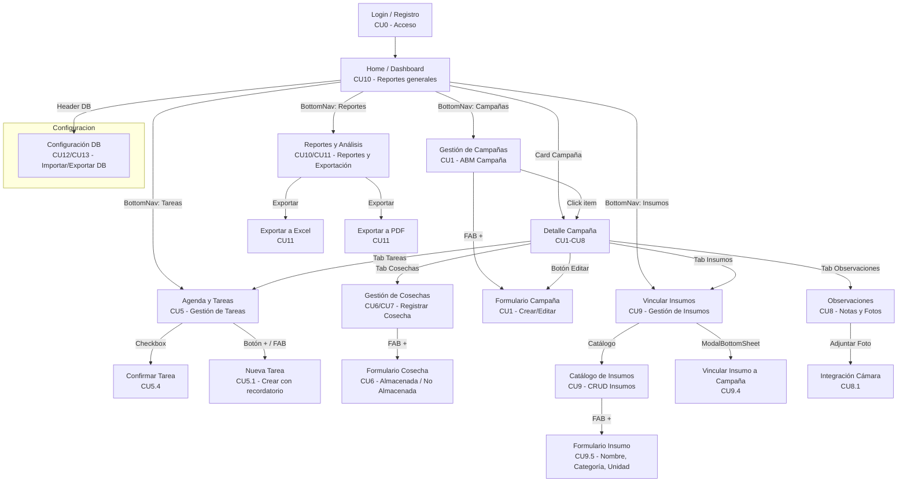

# Diagrama de Flujo de Navegación



## Leyenda de Casos de Uso (CU)

| Código | Descripción | Estado |
|--------|-------------|--------|
| CU0 | Acceso y Registro de Usuario | ✅ Implementado |
| CU1 | Gestión de Campañas (ABM) | ✅ F4/Issue 3 (ViewModel + Use Cases) |
| CU5 | Gestión de Tareas | ✅ F4/Issue 5 (TareaViewModel + ConfirmarTareaUseCase) |
| CU5.1 | Crear Tarea con Recordatorio | ✅ F4/Issue 5 (NuevaTareaViewModel + DatePicker/TimePicker) |
| CU5.4 | Confirmar Tarea | ✅ F4/Issue 5 (checkbox con persistencia) |
| CU6 | Registrar Cosecha (Almacenada/No Almacenada) | 🟡 UI sin ViewModel (F4/Issue 7 pendiente) |
| CU7 | Cosecha No Almacenada (Venta/Reserva) | 🟡 UI sin ViewModel (F4/Issue 7 pendiente) |
| CU8 | Observaciones con Imágenes | 🟡 UI parcial (F4/Issue 8 + F5 pendiente) |
| CU9 | Gestión de Insumos (Catálogo y Asignación) | ✅ F4/Issue 6 (InsumoVinculacionViewModel + catálogo real) |
| CU10 | Dashboard de Reportes y Estadísticas | 🟡 UI con datos mock |
| CU11 | Exportación de Reportes (Excel/PDF) | 🟡 UI con botones mock |
| CU12 | Importar Base de Datos (Restauración) | 🔴 Pendiente (SAF) |
| CU13 | Exportar Base de Datos (Backup) | 🔴 Pendiente (SAF) |

## Refactor de Arquitectura (F4/Issue 1)

El archivo monolítico `screens.kt` (~1200 líneas) se dividió en **27 archivos individuales** organizados por feature, siguiendo Clean Architecture:

### Antes (monolítico)
```
presentation/ui/screens/
└── screens.kt          ← Todas las pantallas en un solo archivo
```

### Después (modular)
```
presentation/
├── navigation/
│   └── NavRoutes.kt                          ← Sealed class con 17 rutas
├── ui/
│   ├── components/
│   │   ├── AgriCoreBottomNav.kt              ← Bottom Navigation (5 tabs)
│   │   ├── CampanaSeleccionadaCard.kt        ← Card de campaña activa
│   │   ├── CardMetricaComparativa.kt         ← Card de métricas
│   │   ├── HeaderSectionAgriCore.kt          ← Header verde con fecha dinámica
│   │   ├── ModuleCard.kt                     ← Card de módulo (ícono + título)
│   │   └── TarjetaTarea.kt                   ← Card de tarea
│   ├── screen/
│   │   ├── campania/
│   │   │   ├── DetalleCampaniaScreen.kt      ← Tabs: Info/Tareas/Insumos/Cosechas/Obs
│   │   │   ├── FormularioCampaniaScreen.kt   ← Crear/Editar campaña
│   │   │   └── GestionParcelasScreen.kt      ← Listado de campañas
│   │   ├── config/
│   │   │   └── ConfiguracionDBScreen.kt
│   │   ├── cosecha/
│   │   │   ├── CosechasScreen.kt             ← Listado de cosechas
│   │   │   └── FormularioCosechaScreen.kt    ← Registrar cosecha
│   │   ├── home/
│   │   │   └── DashboardOperacionesScreen.kt ← Dashboard con lista reactiva
│   │   ├── insumo/
│   │   │   ├── CatalogoInsumosScreen.kt      ← Catálogo global
│   │   │   ├── FormularioInsumoScreen.kt     ← Nuevo insumo
│   │   │   └── InsumosScreen.kt              ← Vinculación a campaña
│   │   ├── login/
│   │   │   ├── LoginScreen.kt
│   │   │   └── RegistroScreen.kt
│   │   ├── observacion/
│   │   │   └── ObservacionesScreen.kt
│   │   ├── reportes/
│   │   │   └── ReportesRendimientoScreen.kt
│   │   └── tarea/
│   │       ├── NuevaTareaScreen.kt           ← DatePicker/TimePicker
│   │       └── TareasScreen.kt               ← Lista con checkbox confirmar
│   ├── screens/
│   │   └── screens.kt                        ← DonElioApp() → NavHost + Scaffold
│   └── theme/
│       └── AgriCoreColors.kt                 ← Paleta de colores
└── viewmodel/
    ├── campania/
    │   ├── CampaniaDetailViewModel.kt        ← Carga campaña por ID + eliminar
    │   └── CampaniaFormViewModel.kt          ← Crear/Editar con validación
    ├── home/
    │   └── HomeViewModel.kt                  ← Lista reactiva de campañas
    ├── insumo/
    │   ├── FormularioInsumoViewModel.kt      ← Crear insumo en catálogo
    │   ├── InsumoCatalogoViewModel.kt        ← Catálogo global
    │   └── InsumoVinculacionViewModel.kt     ← Vincular insumos a campaña
    └── tarea/
        ├── NuevaTareaViewModel.kt            ← Formulario con validación
        └── TareaViewModel.kt                 ← Tareas por campaña + confirmar
```

### Mapeo de pantallas (monolítico → modular)

| Pantalla | Archivo anterior | Archivo nuevo | ViewModel asociado |
|----------|-----------------|---------------|-------------------|
| Login | `screens.kt` | `screen/login/LoginScreen.kt` | — |
| Registro | `screens.kt` | `screen/login/RegistroScreen.kt` | — |
| Dashboard | `screens.kt` | `screen/home/DashboardOperacionesScreen.kt` | `HomeViewModel` |
| Campañas | `screens.kt` | `screen/campania/GestionParcelasScreen.kt` | — |
| Detalle Campaña | `screens.kt` | `screen/campania/DetalleCampaniaScreen.kt` | `CampaniaDetailViewModel` |
| Formulario Campaña | `screens.kt` | `screen/campania/FormularioCampaniaScreen.kt` | `CampaniaFormViewModel` |
| Tareas | `screens.kt` | `screen/tarea/TareasScreen.kt` | `TareaViewModel` |
| Nueva Tarea | `screens.kt` | `screen/tarea/NuevaTareaScreen.kt` | `NuevaTareaViewModel` |
| Cosechas | `screens.kt` | `screen/cosecha/CosechasScreen.kt` | — (F4/Issue 7) |
| Formulario Cosecha | `screens.kt` | `screen/cosecha/FormularioCosechaScreen.kt` | — (F4/Issue 7) |
| Insumos | `screens.kt` | `screen/insumo/InsumosScreen.kt` | `InsumoVinculacionViewModel` |
| Catálogo Insumos | `screens.kt` | `screen/insumo/CatalogoInsumosScreen.kt` | `InsumoCatalogoViewModel` |
| Formulario Insumo | `screens.kt` | `screen/insumo/FormularioInsumoScreen.kt` | `FormularioInsumoViewModel` |
| Observaciones | `screens.kt` | `screen/observacion/ObservacionesScreen.kt` | — (F4/Issue 8) |
| Reportes | `screens.kt` | `screen/reportes/ReportesRendimientoScreen.kt` | — |
| Configuración DB | `screens.kt` | `screen/config/ConfiguracionDBScreen.kt` | — |

### Componentes extraídos

| Componente | Archivo original | Archivo nuevo | Propósito |
|-----------|-----------------|---------------|-----------|
| BottomNav | `screens.kt` | `components/AgriCoreBottomNav.kt` | Navegación inferior (5 tabs) |
| Header | `screens.kt` | `components/HeaderSectionAgriCore.kt` | Header verde con fecha |
| Card campaña activa | — | `components/CampanaSeleccionadaCard.kt` | Card reutilizable |
| Card métrica | — | `components/CardMetricaComparativa.kt` | Comparativa de valores |
| Card módulo | — | `components/ModuleCard.kt` | Icono + título |
| Tarjeta tarea | — | `components/TarjetaTarea.kt` | Item de tarea reutilizable |
| Colores | — | `theme/AgriCoreColors.kt` | Paleta centralizada |
| Rutas | — | `navigation/NavRoutes.kt` | Sealed class de rutas |

## Navegación con Parámetros

Todas las rutas que requieren contexto de campaña aceptan `campaniaId`:

| Ruta | Parámetro | Tipo |
|------|-----------|------|
| `DetalleCampania` | `{campaniaId}` | Requerido (path) |
| `FormularioCampania` | `?campaniaId=` | Opcional (query) |
| `Tareas` | `?campaniaId=` | Opcional (query) |
| `NuevaTarea` | `?campaniaId=` | Opcional (query) |
| `Insumos` | `?campaniaId=` | Opcional (query) |
| `Cosechas` | `?campaniaId=` | Opcional (query) |
| `Observaciones` | `?campaniaId=` | Opcional (query) |
| `Campanias` | `?campaniaId=` | Opcional (query) |
