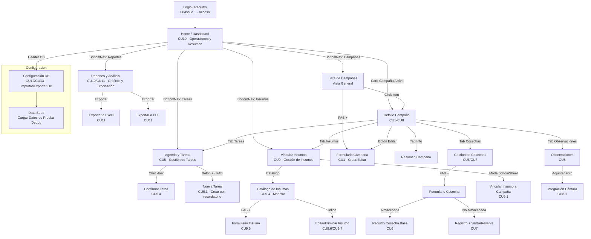

# Diagrama de Flujo de Navegación

## Leyenda de Casos de Uso (CU)

| Código | Descripción | Estado |
|--------|-------------|--------|
| CU0 / F8.1 | Acceso y Registro de Usuario (Login) | ✅ Implementado (Fase 8) |
| CU1 a CU4 | Gestión de Campañas (ABM) | ✅ Implementado |
| CU5 | Gestión de Tareas | ✅ Implementado |
| CU5.1 a CU5.4 | Crear, Editar, Eliminar y Confirmar Tarea | ✅ Implementado (Con DatePicker y Checkbox persistente) |
| CU6 y CU7 | Registrar Cosecha (Almacenada/No Almacenada) | ✅ Implementado (ViewModel y DAO) |
| CU8 | Observaciones | ✅ Implementado (A nivel de datos e UI) |
| CU8.1 | Observaciones con Imágenes (Cámara) | 🟡 Parcial (F5 pendiente) |
| CU9 | Gestión de Insumos (Catálogo y Asignación) | ✅ Implementado (Vinculación y edición inline de catálogo) |
| CU10 | Dashboard de Reportes y Estadísticas | ✅ Implementado (YCharts y datos reales) |
| CU11 | Exportación de Reportes (Excel/PDF) | 🟡 UI con botones mock (SAF Pendiente) |
| CU12 | Importar Base de Datos (Restauración) | 🔴 Pendiente (SAF) |
| CU13 | Exportar Base de Datos (Backup) | 🔴 Pendiente (SAF) |

## Arquitectura Modular (Refactor Finalizado)

La aplicación sigue los principios de Clean Architecture. Los ViewModels acceden a los repositorios a través de UseCases y la UI está modularizada.

### Estructura de Pantallas y ViewModels

| Pantalla | Archivo de UI (`screen/`) | ViewModel asociado |
|----------|---------------------------|--------------------|
| Login / Registro | `login/LoginScreen.kt`, `RegistroScreen.kt` | `LoginViewModel` |
| Dashboard | `home/DashboardOperacionesScreen.kt` | `HomeViewModel` |
| Campañas | `campania/GestionCampaniasScreen.kt` | `GestionCampaniasViewModel` |
| Detalle Campaña | `campania/DetalleCampaniaScreen.kt` | `CampaniaDetailViewModel` |
| Formulario Campaña | `campania/FormularioCampaniaScreen.kt` | `CampaniaFormViewModel` |
| Tareas | `tarea/TareasScreen.kt` | `TareaViewModel` |
| Nueva Tarea | `tarea/NuevaTareaScreen.kt` | `NuevaTareaViewModel` |
| Cosechas | `cosecha/CosechasScreen.kt` | `CosechaViewModel` |
| Formulario Cosecha | `cosecha/FormularioCosechaScreen.kt` | `FormularioCosechaViewModel` |
| Insumos (Asignación) | `insumo/InsumosScreen.kt` | `InsumoVinculacionViewModel` |
| Catálogo Insumos | `insumo/CatalogoInsumosScreen.kt` | `InsumoCatalogoViewModel` |
| Formulario Insumo | `insumo/FormularioInsumoScreen.kt` | `FormularioInsumoViewModel` |
| Observaciones | `observacion/ObservacionesScreen.kt` | `ObservacionViewModel` |
| Reportes | `reportes/ReportesRendimientoScreen.kt` | `ReportesViewModel` / `EstadisticasViewModel` |
| Configuración DB | `config/ConfiguracionDBScreen.kt` | `ConfiguracionDBViewModel` (para DataSeed) |

### Componentes extraídos (`components/`)
- `AgriCoreBottomNav.kt`: Navegación inferior (5 tabs)
- `HeaderSectionAgriCore.kt`: Header verde con fecha dinámica
- `CampaniaSeleccionadaCard.kt`: Card de campaña activa reutilizable
- `CardMetricaComparativa.kt`: Comparativa de valores
- `SelectorCampania.kt`: Dropdown reutilizable (F10/Issue 8)

*Nota: Los componentes `ModuleCard.kt` y `TarjetaTarea.kt` fueron declarados obsoletos (Dead Code - Fase 12).*

## Navegación con Parámetros

Todas las rutas que requieren contexto de campaña aceptan el parámetro `campaniaId` de manera robusta:

| Ruta | Parámetro | Tipo |
|------|-----------|------|
| `DetalleCampania` | `{campaniaId}` | Requerido (path) |
| `FormularioCampania` | Ninguno | Simplificado (Sin parámetro) |
| `Tareas` | `?campaniaId=` | Opcional (query) |
| `NuevaTarea` | `?campaniaId=` | Opcional (query) |
| `Insumos` | `?campaniaId=` | Opcional (query) |
| `Cosechas` | `?campaniaId=` | Opcional (query) |
| `Observaciones` | `?campaniaId=` | Opcional (query) |
| `Campanias` | `?campaniaId=` | Opcional (query) |
