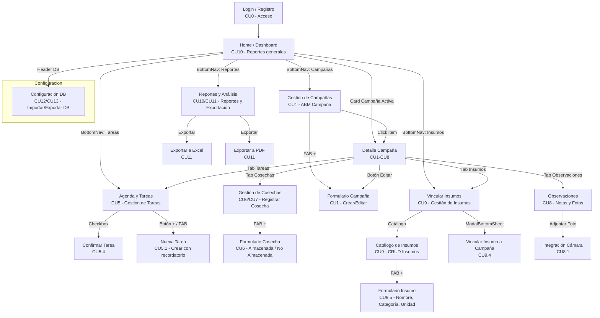

# Diagrama de Flujo de Navegación



## Leyenda de Casos de Uso (CU)

| Código | Descripción | Estado |
|--------|-------------|--------|
| CU0 | Acceso y Registro de Usuario | ✅ Implementado |
| CU1 | Gestión de Campañas (ABM) | 🟡 UI lista, faltan Use Cases |
| CU5 | Gestión de Tareas | 🟡 UI lista, faltan Use Cases |
| CU5.1 | Crear Tarea con Recordatorio | 🟡 UI lista |
| CU5.4 | Confirmar Tarea | 🟡 UI lista |
| CU6 | Registrar Cosecha (Almacenada/No Almacenada) | 🟡 UI lista |
| CU7 | Cosecha No Almacenada (Venta/Reserva) | 🟡 UI lista |
| CU8 | Observaciones con Imágenes | 🟡 UI parcial, falta cámara |
| CU9 | Gestión de Insumos (Catálogo y Asignación) | 🟡 UI lista, faltan Use Cases |
| CU10 | Dashboard de Reportes y Estadísticas | 🟡 UI con datos mock |
| CU11 | Exportación de Reportes (Excel/PDF) | 🟡 UI con botones mock |
| CU12 | Importar Base de Datos (Restauración) | 🔴 Pendiente (SAF) |
| CU13 | Exportar Base de Datos (Backup) | 🔴 Pendiente (SAF) |

## Pantallas por Capa (Clean Architecture)

```
presentation/ui/screens/
├── screens.kt          ← Todas las pantallas (archivo único actual)
│   ├── LoginScreen          (CU0)
│   ├── RegistroScreen       (CU0)
│   ├── DashboardOperacionesScreen  (Home / CU10)
│   ├── GestionParcelasScreen       (Campañas / CU1)
│   ├── DetalleCampaniaScreen       (CU1-CU8)
│   ├── FormularioCampaniaScreen    (CU1)
│   ├── TareasScreen                (CU5)
│   ├── NuevaTareaScreen            (CU5.1)
│   ├── CosechasScreen              (CU6/CU7)
│   ├── FormularioCosechaScreen     (CU6)
│   ├── InsumosScreen               (CU9)
│   ├── CatalogoInsumosScreen       (CU9)
│   ├── FormularioInsumoScreen      (CU9.5)
│   ├── ReportesRendimientoScreen   (CU10/CU11)
│   ├── ObservacionesScreen         (CU8)
│   └── ConfiguracionDBScreen       (CU12/CU13)
```
